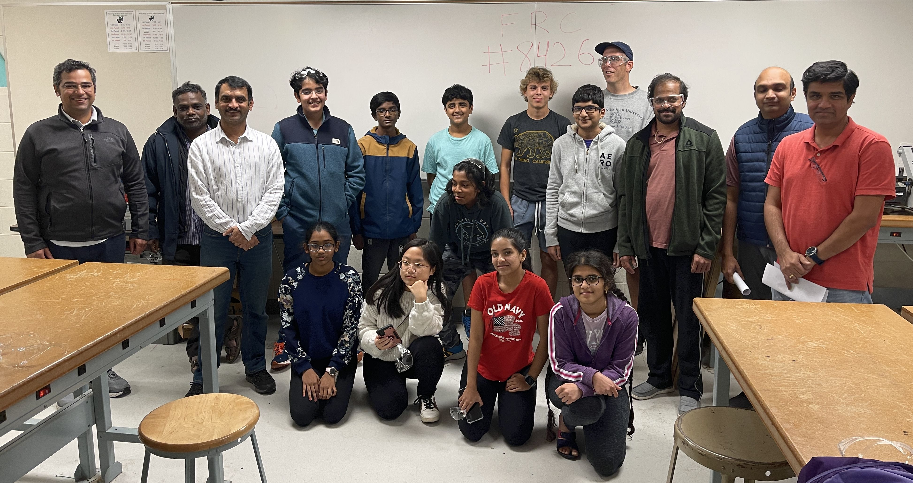

## Who we are and what we do

{: style="float: right;width:200px;padding-left: 2em;"}

Automated Amphibians (Team 8426) is a competitive robotics team that participates in a league called First Robotics Competition (FRC). 

Team 8426 is built from students with little to no robotics experience prior to High School. Team 8426 is also ideal for students looking to take a bigger role on a smaller team. Students will be challenged to learn STEM principals including coding, how to design and fabricate robot parts, and how a group of engineers coordinates a large project towards a single goal. 

A successful season with FRC 8426 isn’t a grind towards an award. For us, a successful season is one that ends with students excited about pursuing deeper levels of mastery in robotics, stem, and academics.

{: width="100%"}

## When 
Team 8426 starts in October and run through April 1st. Meetings are once a week before the challenge is issued in January, but we move to 3-4 meetings a week when the challenge is issued in January.

The Automated Amphibians start with a known working design for the FRC competition and enhances it into a top performing robot. We focus on quality through reliability and repeatability.

## Mentors Needed!
As with all FRC Teams, the Amphibians are always looking for parents and volunteers to be mentors in various areas to assist with the team. We need adults with skills in woodworking skills, programming, digital media, graphic arts, machinists, marketing and finance. All of these roles can help the team to realize their goals.
