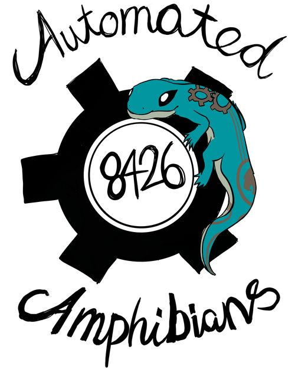

## Who we are and what we do

{: style="float: right;width:200px;margin-left: 2em"}

We are a competitive robotics team in the [FRC (First Robotics Competition)](https://www.firstinspires.org/robotics/frc). We were founded in 2020, but didn't compete in person until 2022. In 2022 we placed 8th out of 40 teams at our first competition. 

**Team 8426 is built entirely from 9th grade students with little to no robotics experience prior to High School.** 

We focus on:
* Developing curiosity and instincts about making, software development, and engineering principals of robot building
* A hands on experience, primarily focused on engineering.
* Maintaining a minimum of 3:1 student to mentor ratio

Students will be challenged to learn STEM principals including coding, how to design and fabricate robot parts, and how a group of engineers coordinates a large project towards a single goal. 

A successful season with FRC 8426 isn’t a grind towards an award. For us, a successful season is one that ends with students excited about pursuing deeper levels of mastery in robotics, stem, and academics.

  
  
  
  

## When 
Team 8426 starts in October and run through April 1st. Meetings are once a week before the challenge is issued in January, but we move to 3-4 meetings a week when the challenge is issued in January.

The Automated Amphibians start with a known working design for the FRC competition and enhances it into a top performing robot. We focus on quality through reliability and repeatability.

## Mentors Needed!
As with all FRC Teams, the Amphibians are always looking for parents and volunteers to be mentors in various areas to assist with the team. We need adults with skills in woodworking skills, programming, digital media, graphic arts, machinists, marketing and finance. All of these roles can help the team to realize their goals.
