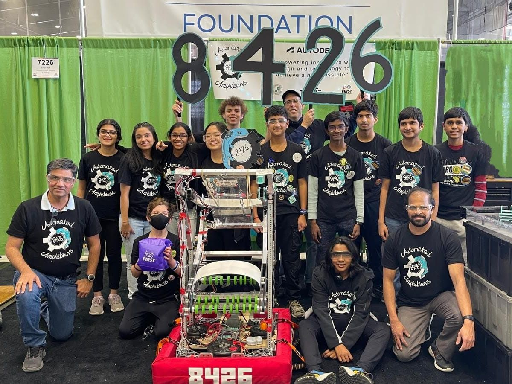

[The Automated Amphibians](about) are a [FIRST FRC](https://www.firstinspires.org/robotics/frc) team based out of Novi High School. 

Automated Amphibians is proud to announce it has qualified for a trip to FRC Worlds Competition! See you in Houston!

    
  

 

Sidebar can be for latest stuff?
Carousel is for highlighted/important stuff

MVP:
    What we're building, goals
    About (contact)
    Tools/Our partners and sponsors
    Previous year (robots)       
    Things we've published (blog, video?) 

 
