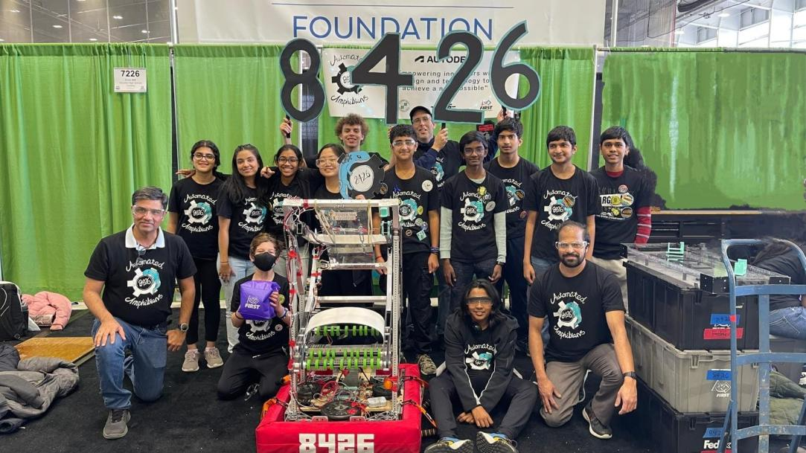
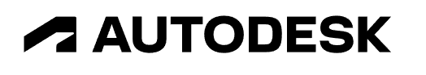

[The Automated Amphibians](about) are a [FIRST FRC](https://www.firstinspires.org/robotics/frc) team based out of Novi High School. 

FRC Team 8426 was founded in 2020, first competed in 2022 and is looking forward to competing in the 2023 Charged Up! competition.

{: width="100%"}

Automated Amphibians is proud to be sponsored by and utilize tools by:

[
{:.logo}
](https://www.autodesk.com/education/competitions/first)

An amazing company with a strong Michigan presence supporting FIRST teams! Thank you!
 

Sidebar can be for latest stuff?
Carousel is for highlighted/important stuff

MVP:
    What we're building, goals
    About (contact)
    Tools/Our partners and sponsors
    Previous year (robots)       
    Things we've published (blog, video?) 

 

