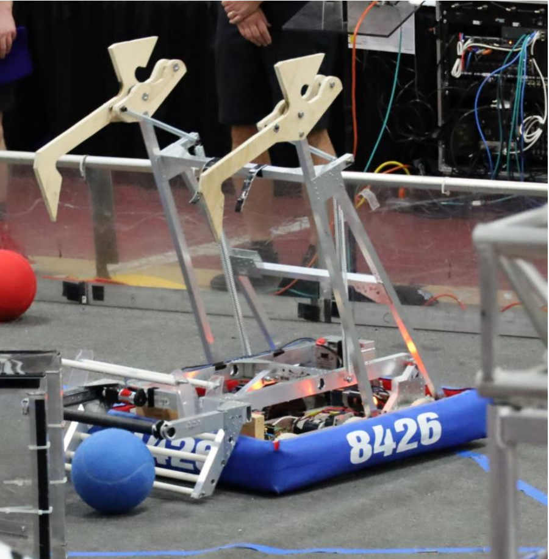

[In 2022 the Automated Amphibians competed at Milford and Walled Lake events.](https://www.thebluealliance.com/team/8426/2022)

The 2022 season had it's challenges, but the Amphibians were up to the task. A small but dedicated group of rookie members worked to put together a reliable robot capable of putting points on the board, and climbing hitting the second level on the bars. 

This robot was based on the [everybot design](https://www.118everybot.org/).

{: style="width: 60%"}

Our robot acheived an 8th place out of 40 teams at the Milford competition.

<iframe width="560" height="315" src="https://www.youtube.com/embed/jfBZiGPcx4w" title="YouTube video player" frameborder="0" allow="accelerometer; autoplay; clipboard-write; encrypted-media; gyroscope; picture-in-picture" allowfullscreen></iframe>

