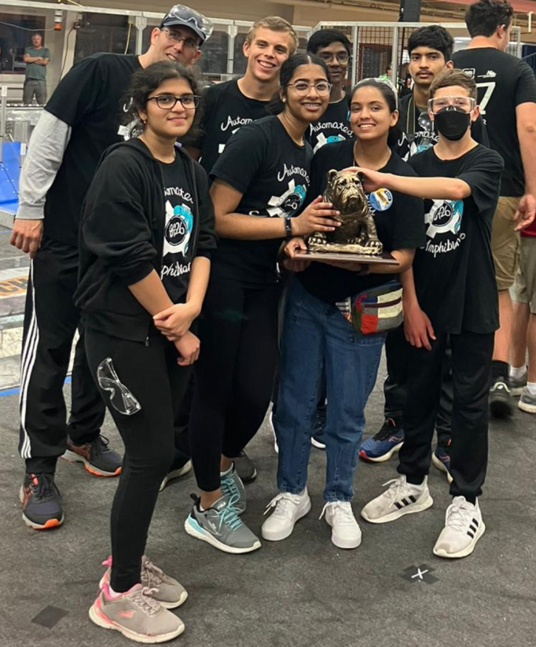

Automated Amphibians competed and won the Bulldog Trophy as the top alliance at the Kettering University Kickoff Event (day 2). 

{: width="300px" style="float:right;margin: 1em;"}

We're especially proud of our robot's consistent performance. We participated in 12 matches, secured nine wins, two losses, and an incredibly fun 164-164 tie during one of the finals matches. 

Hansini and Sanvi took over the driving duties for the first time and performed admirably as they guided the robot through the finals. We recorded no mechanical failures and only a pair of controller issues to be addressed for future competitions. We believe that the focused effort the team put in prior to the competition and between matches helped to keep it running smoothly.

We were honored to be selected for the playoffs by Team 51, the Wings of Fire (Pontiac, MI), and Team 67, HOT - Heroes of Tomorrow (Highland, MI), to form an alliance. Working alongside these incredible teams reinforced the importance of collaboration to insure that driving lanes were clear and we finished with the maximum score.

We want to extend our gratitude to everyone who supported us — our mentors, sponsors, families, and fans. 

Here's to many more challenges and successes ahead! Go Amphibians!

