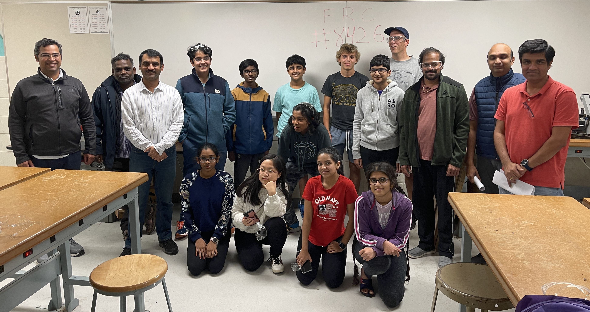

## Who we are:
Automated Amphibains are a competitive robotics team in the [First Robotics Competition (FRC) league](https://www.firstinspires.org/robotics/frc).

We were founded in 2020, but didn't compete until 2022 due to the pandemic. In 2022, our first year of competition, we placed 8th out of 40 teams. 

## What makes us unique?

{: style="float: right;width:200px;margin-left: 2em"}

**Team 8426 is built entirely from 9th grade students with little to no robotics experience prior to High School.** 

We focus on:
* Developing curiosity and instincts about making, software development, and engineering principals of robot building
* A hands on experience, primarily focused on engineering.
* Maintaining a minimum of 3:1 student to mentor ratio

Students will be challenged to learn STEM principals including coding, how to design and fabricate robot parts, and how a group of engineers coordinates a large project towards a single goal. 

A successful season with FRC 8426 isn’t a grind towards an award. For us, a successful season is one that ends with students excited about pursuing deeper levels of mastery in robotics, stem, and academics.

{: width="100%"}

