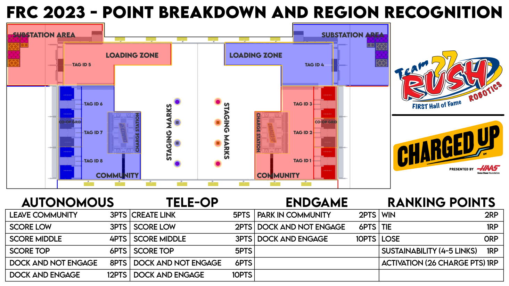

### Field Layout

### Use WPILib swerve code?
https://www.chiefdelphi.com/t/moving-swerve-code-from-sds-to-wpi/418993/4

### Balancing Robot Code
https://www.chiefdelphi.com/t/warning-to-everyone-working-on-auto-balance/422460/8

https://github.com/GOFIRST-Robotics/Ri3D-2023/blob/main/src/main/java/frc/robot/commands/BalanceOnBeamCommand.java

https://www.youtube.com/watch?v=2D3LOCGfEc4

https://www.mathworks.com/help/control/ug/two-degree-of-freedom-2-dof-pid-controllers.html

### Discussion of scouting

For comparison sake, this is what I think Frog Force is going to be looking for when we select our alliance partners (and the top teams at your events should be similar).  At this point, we don't care if a team scores only one kind of piece, although diversity is always better.  There are 6 spots to score cubes and 12 to score cones, and 9 where either one can be scored.  Very good teams might be scoring 8-10 in a match, so nobody should run out of spots to score. I think we optimistically calculated every robot can technically score as many as 7-8 during teleop, but even if everyone scores one during auton, there's no shortage of space. I am curious to see how many single game piece type robots there are, and what type it will be. I'm sure if the everybot is only one type (which seems logical), then that could dominate.

1. The captain (hopefully us).  Can do everything.  Score at least two pieces in autonomous and balance.  If we're capable of scoring more than two, at least one of our partners needs to be able to balance in auton reliably.  Can score both game pieces at all levels, as many as possible.  Can triple-balance at the end.
2. First pick.  As close to a copy of the captain as possible.  We want to team up the two best scoring robots and win.  We'd be looking for a 2-piece autonomous, with or without the auton balance, depending if the captain is capable of using that time for another piece (If all we can ever do is two, then we'll probably just do those two and balance... we tend to not trust other teams if we're confident in ourselves).  Preferably on the skinnier side so we can easily triple-balance at the end.
3. Second pick.  This robot is probably going to play defense during the playoffs unless they're just a phenomenal scorer.  Traffic jams at the loading station and the Community make it best to not always have three scoring bots when two of them are high-powered.  Our first criteria is swerve, if possible.  Since the first two robots will be doing 2-piece autons, we probably just want this one to score their pre-load and balance.  If they've demonstrated that they can leave the community for the mobility points, without going so far that they interfere with the pieces on the floor, they can do that, but most likely we don't even want them to leave the Community, just score and balance.  They'll play defense during teleop most likely.  Be skinny enough to triple-balance.
4. What about a runner robot?

> This gets me into a whole different conversation that I could write another book on.  The short version is, for the playoffs the alliance captain is generally recognized as the leader of the alliance.  They likely drafted each team with a role in mind for them.  So it's not uncommon for the third robot to be drafted "to play defense", and it's appropriate to make that "demand".  The captain may (and should) ask for input, but in the end it's their call.  

> There are no such expectations in the qualification matches.  It doesn't matter if it's a rookie team and a Hall of Fame team, everybody should have input on the plan.  Don't let teams "tell" you what you're going to do during quals.  A lot of times teams are told to "play defense" as a way of saying "stay out of our way."  I can totally see this. (hopefully we get there and make use of this advice)  If it makes sense for you to play defense, they should be able to explain why, maybe using numbers from their scouting data.  And even if they do show you "you only score two pieces, and we think you could slow down the other team by a larger margin than that", you don't have to do it, although that tends to make teams mad at you and if they're one of the top teams at the event that kills your chances of them picking you.  But if you think you've fixed your intake that hasn't been working and you really need to try it, tell them that.  Maybe you agree that you'll try one or two pieces, and if t's not working in 15 seconds you'll abandon it, but if it's working you want to keep scoring, and you can agree that the faster scoring bot will get the right-of-way in the loading and scoring zones, or whatever.  The bottom line is you can listen to their advice, but you don't have to.  Just make sure to do what you say you will.  Teams that agree to a plan, even reluctantly, and then don't follow it end up on "do no pick" lists. Kinda get that.