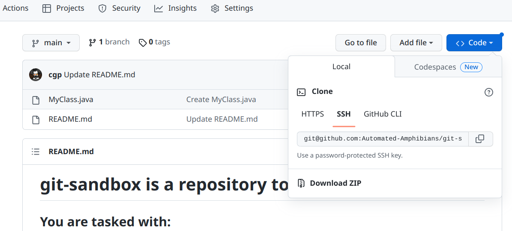
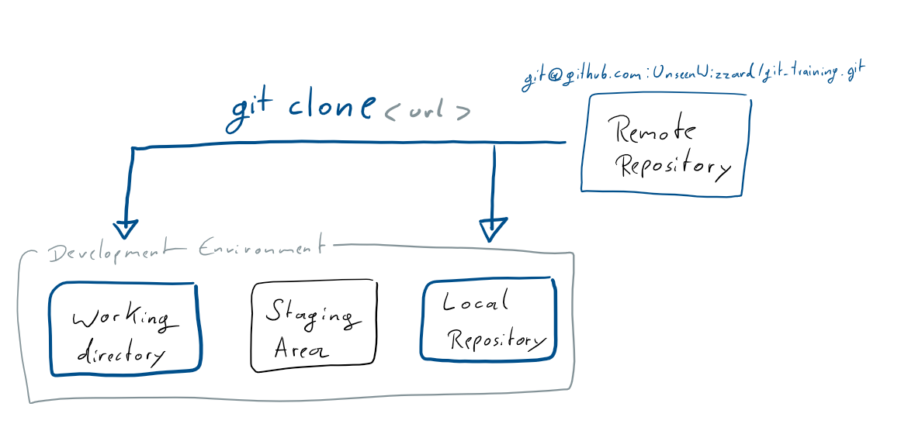
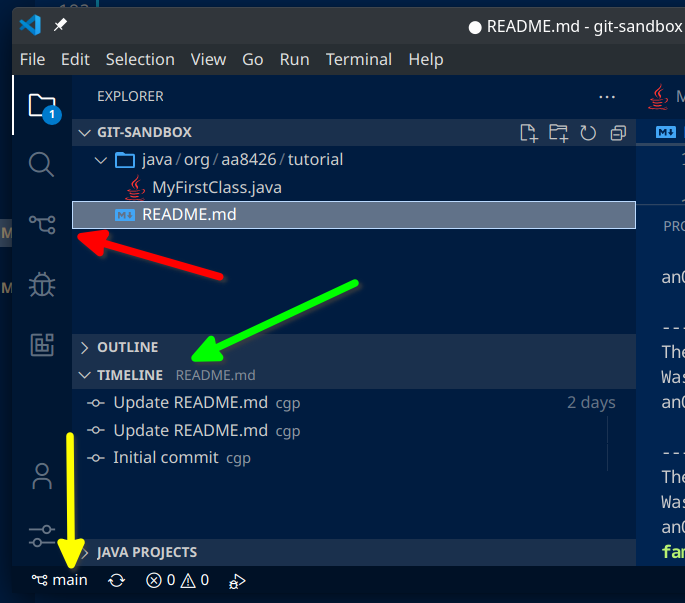
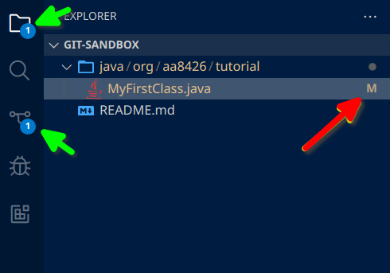
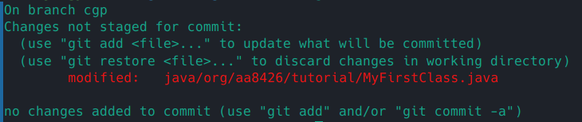
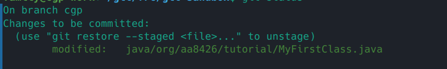
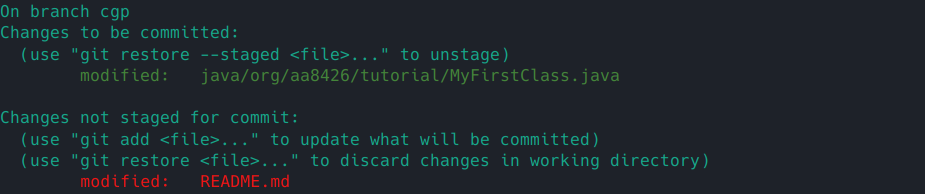
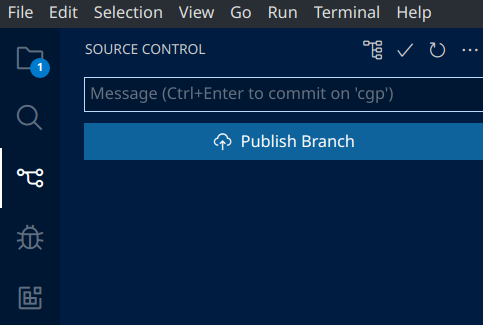

See [curriculum](/frc-survival-guide/aa-handbook/curriculum/coding-curriculum).

[Quiz questions help to reinforce the material.](git-quiz)

This tutorial assumes you have git installed, and that you've generated an ssh key using the `ssh-keygen` tool from the command line and 
attached it to your github account.

### Learning
##### What is version control or Source Control Management (SCM)? 
Lets take a very practical example. You're writing robot code in a project. You change 5 java files of the 300 java files in the project.
You want to share it with other team members. But you don't want to mess up what they are already working on because they have their
own changes to the project. `Source Control Management` or `SCM` is exactly what you are looking for. 

In this example, you want to `PUSH` your code somewhere else. Your teammates want to `PULL` your code onto their computer.

##### Starting GIT
GIT is an application that does Source Control Management. It is a very popular tool, for many good reasons.

We're going to use the command line version of git here for a couple of reasons:

* It is better for teaching the fundamentals of GIT.
* The same version is available on all operating systems we use.
* It always has the latest features. (no tool adds core features to git before the command line tool)
* It always works. (If it doesn't, you have bigger problems, or you need to configure it properly.)
* Sometimes you don't have GUI. It works over SSH remote sessions. I mean, it's the command line version, right?

This isn't to say you shouldn't use git as it is embedded in VS Code or some other tool (Github Desktop) -- However, the version within the version of VS Code
wpilib broke sometime in the last 3 months, 

Using git from the command line is a indicator of technical expertise to someone who is interviewing you. 

It is important to understand that `git` is to github as your iphone is to the icloud.

You use `git` locally to push your code and store it on github. Unlike the iphone, you can use `git` with multiple clouds or server environments.
You can even push from one computer to another if you understand how to set it up. 
[//: ] This is called distributed version control.

We will stick to simple examples.

If you've installed git correctly, you should be able to goto a command line, type in "git" and get something along the following lines:

```
cgp@computer:~/git/frc$ git -h
usage: git [-v | --version] [-h | --help] [-C <path>] [-c <name>=<value>]
        [--exec-path[=<path>]] [--html-path] [--man-path] [--info-path]
        [-p | --paginate | -P | --no-pager] [--no-replace-objects] [--bare]
        [--git-dir=<path>] [--work-tree=<path>] [--namespace=<name>]
        [--super-prefix=<path>] [--config-env=<name>=<envvar>]
        <command> [<args>]        

... rest cut out

```
It's a good practice to get used to [reading the manual to get help for a command](console#reading-the-manual). 

GIT manages collections of files and folders called a `repository`.  When you `clone` something, you are copying a repository to your
local hard drive. 

Lets start by cloning a sandbox we can play in:

    git clone git@github.com:Automated-Amphibians/git-sandbox.git

You can find the SSH version under the code button:



You should see something like:

```
cgp@computer:~/tmp$ git clone git@github.com:Automated-Amphibians/git-sandbox.git
Cloning into 'git-sandbox'...
remote: Enumerating objects: 19, done.
remote: Counting objects: 100% (19/19), done.
remote: Compressing objects: 100% (14/14), done.
remote: Total 19 (delta 2), reused 7 (delta 0), pack-reused 0
Receiving objects: 100% (19/19), done.
Resolving deltas: 100% (2/2), done.
```

Change your `working directory` to the sandbox.

    cd git-sandbox

##### Starting to working with a GIT repository
A git repository is nothing more than a single folder that happens to have your files alongside a .git folder which is used to
manage the GIT related data. 

Often the first thing we do when we enter a git repository folder is check the status. Sensibly, the command is:

    git status

You should see something like:

```
cgp@computer:~/git/frc/git-sandbox$ git status
On branch main
Your branch is up to date with 'origin/main'.

nothing to commit, working tree clean
```

If you see something like:

```
fatal: not a git repository (or any of the parent directories): .git
```

then you aren't in a git repository folder. You will need to try the clone again, or ask someone for help.

If you want to see how GIT stores your SCM data in files, you can always explore the .git folder under the repository directory.

It should look something like this: (on the command line run `ls -las` for linux/macos or `dir` for windows)
```
cgp@computer:~/git/frc/git-sandbox$ ls -las
total 20
4 drwxr-xr-x  4 family family 4096 Jan  2 10:54 .
4 drwxr-xr-x 17 family family 4096 Jan  2 10:52 ..
4 drwxr-xr-x  8 family family 4096 Jan  2 17:39 .git      <<-- .git contains current modifications/previous history
4 drwxr-xr-x  3 family family 4096 Jan  2 10:54 java      <<-- everything else is part of the working directory
4 -rw-r--r--  1 family family  224 Jan  2 10:52 README.md <<-- 
```

You see the files and folders shared with you from the remote repository. Below is a diagram of what happened when you cloned 
the directory in the earlier step is shown below. The box labeled `staging area` and `local repository` folders are responsible
for maintaining all of the change history (the actual local repository) and tracking what is currently modified (staging). 



If you do a file listing in the .git directory, you'll see lots of interesting files. I encourage you to explore these on your own time, 
as curiousity is a great way to learn new features. (Only change files that you know what they do!)
```
cgp@computer:~/git/frc/git-sandbox/.git$ ls -las
total 60
4 drwxr-xr-x  8 family family 4096 Jan  2 17:39 .
4 drwxr-xr-x  4 family family 4096 Jan  2 10:54 ..
4 drwxr-xr-x  2 family family 4096 Jan  2 10:52 branches
4 -rw-r--r--  1 family family   14 Jan  2 17:39 COMMIT_EDITMSG
4 -rw-r--r--  1 family family    8 Jan  2 17:39 COMMIT_EDITMSG.bak
4 -rw-r--r--  1 family family  272 Jan  2 10:52 config
4 -rw-r--r--  1 family family   73 Jan  2 10:52 description
4 -rw-r--r--  1 family family   21 Jan  2 10:52 HEAD
4 drwxr-xr-x  2 family family 4096 Jan  2 10:52 hooks
4 -rw-r--r--  1 family family  370 Jan  2 17:39 index
4 drwxr-xr-x  2 family family 4096 Jan  2 10:52 info
4 drwxr-xr-x  3 family family 4096 Jan  2 10:52 logs
4 drwxr-xr-x 18 family family 4096 Jan  2 17:39 objects
4 -rw-r--r--  1 family family  112 Jan  2 10:52 packed-refs
4 drwxr-xr-x  5 family family 4096 Jan  2 10:52 refs
```

#### Branching
Now we want to make our changes. But we don't want to make changes that will bump up against someone else. So we take our code,
and we branch it. In other SCMs, the main branch is called trunk. In GIT it happens to be called main. So we create a branch
from main using the following command:

    git branch <YOUR_BRANCH_HERE>

The name of the branch is up to you, but there are usually strategies to naming a branch. There is a method called feature branching
where the name of the branch matches the type of feature being implemented. If you were implementing a drivetrain, you'd call it drivetrain.
Another strategy might be to simply use your own name. Sometimes a combination of strategies might be needed. Maybe you are working on multiple features,
so you have multiple branches, so you might name one branch *bob-drivetrain*, and another *bob-arcade-driving*. Remember! Branch names
cannot have spaces in them!

*What if I make a mistake?*

Delete the branch with:

    git branch -d <YOUR_BRANCH_HERE>

*What if I forget the name of the branch I was working on?*

List all of the branches along with your current branch with: 

    git branch -v

#### Checkout and start working
We're ready to start working right? Not quite, we need to be "on the branch" to safely edit without bumping into anyone else. This is easy.

    git checkout <YOUR_BRANCH_HERE>

We can verify that we're on the branch that we think we are by checking the status again:

```
cgp@computer:~/git/frc/git-sandbox$ git status
`On branch main`
Your branch is up to date with 'origin/main'.

nothing to commit, working tree clean
```

*Oh, that's not what we want.*

Nope, we need to `checkout` the branch before we are on the branch. All branch does is create/add/delete the branch. Again, the command is obvious:

    git checkout <YOUR_BRANCH_HERE>

Check the status, and it should be good. 

In fact, because it is so common to create a branch and then switch to it, there is a shortcut:

    git checkout -b <YOUR_BRANCH_HERE>

This will create your branch then switch to it at the same time.

The `checkout` command has another useful shortcut. When you want to just switch back to the branch you were on before, you can use a dash.

    git checkout -

For us, will checkout the last branch we were on. If that was *main*, you can do a `git status` and you'll see that you're on main. Just remember to do the same `git checkout -` command to switch back again.

### Getting to work

Now that we're officially on our branch, we're ready to do some work.

Open up the repository folder in VS Code. It should end up looking something like this:



You can take note of three things:
* Red arrow: On the left there is a source control icon that lets us perform git commands (we're going to stick to the command line for now)
* Green arrow: Towards the bottom the *timeline* feature shows us the history of the file I currently have selected. In this case the README.md file
    has three changes, the most recent of which was 2 days ago. There are also comments provided by the developer as to what changes were made.
* Yellow arrow: At the absolute bottom, there is an indicator of which branch we are on. I'd better not make changes, I'm on main!

You should see a source control icon on the left (pointed to by the red arrow). Don't click it yet. 
When you click on a file in the explorer, you should see towards the bottom a heading called "timeline". You probably
have to click on it to show the contents.
Timeline is history of changes made to the selected file. In this case, there were 
three changes to the file, the most recent of which was two days ago.

Lets go ahead and change a file. Add a comment of your choosing to the MyClass.java file.



After your change on the left there is an indicator of how many files have changed. On the right, 
there is an indicator for which files have changed with an M.

Lets walk through saving our changes (called making a `commit`) so they can be shared on the server (called `pushing`).

Run a `git status` again and now you should see something like:



So, it sees our changes. Great. (how does it know?)

### Lets get to `staging` our changes so they can be saved

There are three primary ways to add or stage our changes:

* `git add <FILEPATH>` - (in this case git add java/org/aa8426/tutorial/MyFirstClass.java)
* `git add .` - this adds everything in all the subfolders
* `git add -all` - this adds everything in the working directory that has changed

After adding using the command above, we can do a git status, and it will look like the following:



Looking closer: In the first screenshot, it the change was in red, and reading closely, it says
*Changes not staged for commit:*. In the second screenshot, we used the `add` command to stage
our changes and so above the listing of green it says *changes to be committed*.

If we had some files that were added to stage but some that were not we would see:



Now, we can add more files to the stage, readying them to be committed for saving, but it's time for us
to commit. The command is pretty straightforward:

    git commit -m "I made a change"


You should get a response something like:

    cgp - .git/COMMIT_EDITMSG
    [cgp 8ba087c] cgp: made a change
    1 file changed, 1 insertion(+)

<details markdown="1">
<summary>I didn't get that...</summary>

*Did you get something more like this?*

```
Author identity unknown

*** Please tell me who you are.

Run

 git config --global user.email "you@example.com"
 git config --global user.name "Your Name"

to set your account's default identity.
```

Just follow the instructions and you should be good to continue the tutorial.

</details>

The `commit` command tells it to commit the staged changes to the local repository for permanent safe keeping
and to be shared later. The `-m` option along with the quoted text provides a comment. If you leave off
the comment, git will attempt to open a text editor to let you write a longer comment. Usually providing a short
comment on the command line is the right thing to do. 

If we do a git status:

    On branch cgp
    nothing to commit, working tree clean

It says there's nothing to commit. Nothing has been changed since the last commit, so that's good.

### Changes are saved locally in the repository, how do we know?

But how can we see our commit? In VS Code:



In in VS Code, we see that the timeline has updated (not shown above, just select the java file to see it update the timeline). 
If we click the SCM icon on the left, we get a button to publish the branch. 

All good to know, but in case we are in a place without a fancy tool like VS Code or for some reason the git extension is broken, 
lets do this from the command line. Enter the following command:

    git log

You should see something like:

    commit 8ba087ce31c1e13b092aee35052a6c856a4283d2 (HEAD -> cgp)
    Author: Chris Pall <chrispall@gmail.com>
    Date:   Tue Jan 3 13:32:19 2023 -0500

        cgp: made a change

    commit 3493137b97846080193fe7165bdf88936377b07a (origin/main, origin/HEAD, main)
    Author: Chris Pall <chrispall@gmail.com>
    Date:   Mon Jan 2 17:39:20 2023 -0500

        main: updates

    ..........................GOES ON FOR A LONG TIME

So, that's great, but not particular nice to look at.

### A small aside to make our lives easier and increase power

Ah, now we see our change. This is useful, but we can do better. Try this command:

    git log --all --decorate --oneline --graph

Now we get:

    8ba087c - (HEAD -> cgp) cgp: made a change (82 minutes ago) <Chris Pall>
    * 3493137 - (origin/main, origin/HEAD, main) main: updates (21 hours ago) <Chris Pall>
    * 3bf7d74 - main: moved myclass into better named package (28 hours ago) <Chris Pall>
    * e082634 - Update README.md (3 days ago) <cgp>
    * 30b4004 - Update README.md (3 days ago) <cgp>
    * c618595 - Create MyClass.java (3 days ago) <cgp>
    * c720c1d - Initial commit (3 days ago) <cgp>

Oh, so much better, but now that's a whole lot to type just to see the history. I'm never going to remember that. 
We can create an shorter `alias` of our own design that's easy to remember.

    git config --global alias.logs "log --all --decorate --oneline --graph"

Now we can type `git logs` (from the *alias.logs* part of the configuration command up above) and get the exact same thing.
What you name the alias is completely up to you, as long as the command hasn't been already used.

Of course, in the future you're never going to remember that config command either. Like other applications, git stores
things that it needs to remember like configuration options in a file in your [profile](console#profiles) folder/path. 

    cat ~/.gitconfig

So, you can see aliases configured there. As long as you maintain the same format, you don't need the command, you 
can just manually add it in.

### Enough screwing around, lets `push` our share our changes with the cloud
Alright, as the title says, lets push our changes:

    git push -u origin <YOUR_BRANCH_NAME>

You should see output similar to:

```
cgp@computer~/git/frc/git-sandbox$ git push -u origin cgp
Enumerating objects: 33, done.
Counting objects: 100% (33/33), done.
Delta compression using up to 12 threads
Compressing objects: 100% (19/19), done.
Writing objects: 100% (33/33), 5.36 KiB | 5.36 MiB/s, done.
Total 33 (delta 3), reused 11 (delta 1), pack-reused 0
remote: Resolving deltas: 100% (3/3), done.
remote: 
remote: Create a pull request for 'cgp' on GitHub by visiting:
remote:      https://github.com/Automated-Amphibians/git-sandbox/pull/new/cgp
remote: 
To github.com:Automated-Amphibians/git-sandbox.git
* [new branch]      cgp -> cgp
branch 'cgp' set up to track 'origin/cgp'.
```

Also observe the following:

* Your commit should show up on github
* VS Code will no longer show the publish button. (it is showing now that no files have changed)

There's a lot to unpack in the above, but let's do it after we try and get your classmates changes.

```
cgp@computer:~/git/frc/git-sandbox$ git pull
remote: Enumerating objects: 5, done.
remote: Counting objects: 100% (5/5), done.
remote: Compressing objects: 100% (3/3), done.
remote: Total 3 (delta 1), reused 0 (delta 0), pack-reused 0
Unpacking objects: 100% (3/3), 723 bytes | 723.00 KiB/s, done.
From github.com:Automated-Amphibians/git-sandbox
* [new branch]      grian      -> origin/grian
3493137..e2ab178  main       -> origin/main
Already up to date.
```

Ah, look at that, we've got grians' changes now. We could go look at them by just checking out that branch with:

    git checkout grian

So, lets unpack what just happened with the push and the pull commands because there is a bit of subtle detail here.

The first time we push, we do 

    git push -u origin <BRANCH_NAME>

Subsequent pushes will just use:

    git push

So what is the `-u origin <BRANCH_NAME>` all about? Lets start with this command:

    git remote -v

You should get something like:

    origin  git@github.com:Automated-Amphibians/git-sandbox.git (fetch)
    origin  git@github.com:Automated-Amphibians/git-sandbox.git (push)

Git has to know where with which `remote repository` we will be using to share. When we performed the initial `clone` to copy the 
repository from github, it used the url we provided to create a `remote` entry. You can have multiple remotes, but that's well
beyond the scope of this tutorial, for now we are just going to stick with the remote name *origin*.

Lets do the command:

    git branch -vv

You should get something like:

    family@cgp-work:~/git/frc/git-sandbox$ git branch -vv
    * cgp      8ba087c [origin/cgp] cgp: made a change
      main     3493137 [origin/main] main: updates
      grian    3493137 [origin/main] main: updates
      cgp-test 3493137 main: updates

When we issue the `git push -u origin <BRANCH_NAME>` command, it binds your branch to the `remote` known as *origin*.
You can see in the first column the branch name and then you can see after the `hash` id, sometimes there is a *remote/branch* specified.
If there is no *remote/branch*, then that is a local only branch. For this example, I created a branch *cgp-test*, but didn't push it to the server.

If you want to be lazy (and, I won't completely blame you if you are), you skip using `git push -u origin <BRANCH_NAME>` and just
use `git push`. When you haven't bound the branch to the remote when you use the git push command, it will complain and instruct you
exactly what command to use to do the binding. You can copy and paste it exactly as it says. (note that it uses the longer `--set-upsteam` 
instead of `-u`, but it is the same command) You can also set an alias that would do the binding. But only use that when you push that 
first time from a fresh branch.

This is the absolutely most basic usage we can get away with. I'll do a quick follow up to reinforce the core concepts and how to use 
VS Code to do perform changes instead of the command line, because while I use the command line, some students will prefer to stay 
in the editor. 

I recommend downloading a good [cheatsheet](https://ihatetomatoes.net/wp-content/uploads/2020/05/git-cheat-sheet-v01.pdf) to help remind 
you of commands, but also of course reading from the references, in particular the [GIT Handbook](https://git-scm.com/book/en/v2)

I also highly recommend we complete a more advanced usage that talks about the following:

* git merge
* git reset 
* git reset --hard
* git clean -dxf
* git stash
* git stash pop
* git branch -vv
* git remote -vv
* git revert
* Talk about hashes

### Quick reference
* `git status` branch and files currently staged
* `git clone <URL_TO_REPOSITORY>` clone the repository at the given url
* `git checkout -b <BRANCH_NAME>` creates a new branch called BRANCH_NAME and checks it out
* `git checkout <BRANCH_NAME>` checks
* `git checkout -` checks out the last branch
{:.code-list}


### Other References
####  References
* [GIT cheatsheet](https://www.jrebel.com/blog/git-cheat-sheet)
* [Another GIT cheatsheet](https://ihatetomatoes.net/git-cheat-sheet/)
    * [just the pdf](https://ihatetomatoes.net/wp-content/uploads/2020/05/git-cheat-sheet-v01.pdf)
* [GIT Handbook](https://git-scm.com/book/en/v2) - This is all the gory details. GIT is a beautifully designed system put together by none other than
the benevolent dictator of Linux, [Linus Torvalds](https://en.wikipedia.org/wiki/Linus_Torvalds). It is simple but powerful.

#### More Tutorials
* [https://frc3512.github.io/ci/intro-to-git/](https://frc3512.github.io/ci/intro-to-git/)
* [https://learngitbranching.js.org/](https://learngitbranching.js.org/)
* [What is version control](https://www.perforce.com/blog/vcs/what-source-control#:~:text=These%20two%20terms%20are%20used,binary%20files%20and%20digital%20assets.)
* [Learn git concepts, not commands](https://github.com/UnseenWizzard/git_training)
* [GIT Immersion](https://gitimmersion.com/index.html)
* [Links to other git tutorials](https://github.com/git/git-scm.com/issues/1239)

### Notes for later
* https://stackoverflow.com/questions/2765421/how-do-i-push-a-new-local-branch-to-a-remote-git-repository-and-track-it-too

* Why use the command line version of git?
    * It works everywhere.
    * It has all the commands
