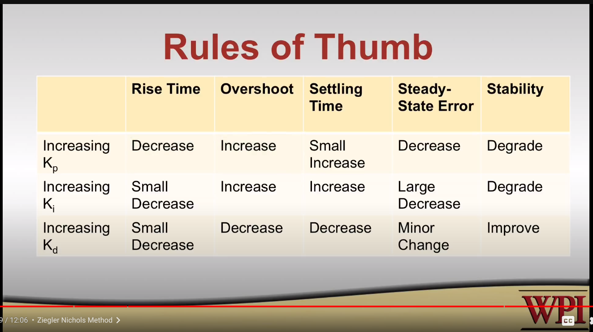

[Taken from the following video](https://www.youtube.com/watch?v=UOuRx9Ujsog&list=PLhwpRbR67J4ZeRu3oOCAZ7ocHwhJYFZVE)

* `Open Loop Control` - also known as `non-feedback system` is any system that doesn't take input and adjust to do a particular job/thing. Good examples are simply turning on a motor for a prescribed amount of time.
* `Closed Loop Control` - also known as a `feedback-system` is any system that reads input and adjusts it's output to try and get the input to match a target. For example, an air-conditioner takes temperature as an input, and can turn on or off based on whether it has reached the proper temperature or not.
* `Rise Time` - Time it takes to rise from 10% to 90% of your `set-point`
* `Set point` - The target value of the control system. For example, the temperature in a freezer, the angle of an arm, or the speed of a robot.
* `Percent Overshoot` - How much you go past your `set point`. This is not the value you set 
* `Steady State Error` - When your system settles, this is the consistent difference between the `set point` and where the system settled
* `Settling Time` - How long it takes to reach steady state
* `PID` - Proportional Integral Derivative
    * Three Control Requirements
        * Immediate response to current error
        * Zero Stredy state error
        * Responds to transient errors
* `Transient errors` - errors that occur while the controller is running
* `Gains` - Kp (proportion), Ki (integral (of error)), Kd (derivative)
* `Instability` - Violent oscillation while trying to avhieve the set point
* `Sensor Lag` - A common cause of instability
* `Ziegler Nicols Method` (rule of thumb)
    1. Set Ki and Kd to 0
    2. Increase Kp **SLOWLY** until you see oscillation, but be very careful. Oscillation should be steady -- not grow, or it will likely break something.
    3. Write down the value of Kp as Kc. This is called the `critical gain`.
    4. Write down how long it takes for the system to oscillate one period. This value is notated as Pc. This is also called the Oscillation Period.
        * ?? I'm not sure how you do this, maybe with the output graph? Seems like it would be really quick.
    5. Now you can set PID gains as:
        * Kp = 0.6 * Kc
        * Ki = 2 * Kp/Pc
        * Kd = 0.125 \* Kp \* Pc

    Naturally, this method doesn't always work, could be a little aggressive and may produce some overshoot on the set point.

    To further tweak, this chart may be helpful:
    

    Kd is particularly dangerous and prone to creating damaging instability, use very small changes.